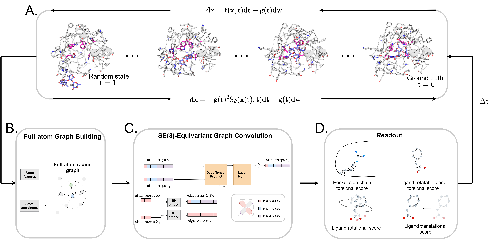

# DiffBindFR: An SE(3) Equivariant Network for Flexible Protein-Ligand Docking

[](https://doi.org/10.1039/D3SC06803J)
[](https://pytorch.org/get-started/locally/)

This is the official repository for the DiffBindFR, which is the accurate diffusion model based flexible protein-ligand docking method. This repository contains a part of our in-house $\color{Red}\text{Deep Learning Based Drug Discovery Python Packages, named Druglib}$, and all inference and evaluation scripts to help users reproduce our reported results and apply it in protein-ligand structure modeling and structure-based drug design. We expect DiffBindFR is helpful for your awesome research. If you have any question, feel free to open a [github issue](https://github.com/HBioquant/DiffBindFR/issues) or reach out to us: [zhujt@stu.pku.edu.cn](zhujt@stu.pku.edu.cn), [guzhh20@stu.pku.edu.cn](guzhh20@stu.pku.edu.cn).



</details>

<details open><summary><b>Table of contents</b></summary>

- [Installation (Linux)](#installation)
- [Inference](#inference)
  - [Forward docking](#foward)
  - [Reverse docking](#reverse)
  - [Users-tailored pairing docking](#userdefine)
- [Evaluation](#evaluation)
  - [Benchmark on PoseBusters set](#pbbench)
  - [AlphaFold2 modelled structure refinement](#af2refine)
- [Citation](#citation)
- [License](#license)
- [Acknowledgements](#acknowledgements)
</details>

## Installation (Linux)  <a name="installation"></a>
All Python dependencies are specified in [`env.yaml`](env.yaml). This package is currently supported for CUDA 11.7 and pytorch 1.13.1. You can change the dependencies by modifying the corresponding CUDA and pytoch version, also pytorch-geometric packages, in [`env.yaml`](env.yaml), to match your local CUDA configuration. 

Firstly, clone the repo, e.g.

```shell
git clone https://github.com/HBioquant/DiffBindFR.git
```

Then, set up a conda environment in the project directory, and run the command

```shell
conda env create -f env.yaml
conda activate diffbindfr
```

### Installing from source

If you’re sure you want to install from source, check the [recipe](requirements/) for current dependencies, install them, especially Pytorch and PyTorch-geometric, and then run in the project directory:
```shell
pip install -e .
```
This will activate command line tool and users can use command `DiffBindFR` rather than `python DiffBindFR/app/predict.py` for convenience.

Note that the project directory must be added to the environment variable `PYTHONPATH` if you do not want to do the installation from source.
```shell
export PYTHONPATH=/path/to/diffbindfr/:$PYTHONPATH
```

### Installing openff-toolkit from source
**Optionally**, we also release the protein-ligand complex structure relaxation script by running the energy minimization in [**pl.py**](DiffBindFR/relax/pl.py), which requires additional [Openff package](https://github.com/openforcefield/openff-toolkit). Installing this package through conda in `diffbindfr` environment will always result in packages conflict, so here we provide the installation script in th project directory, run the command

```shell
bash INSTALL_OPENFF.sh
```

### Download model weights
We have uploaded the model weights to **[Zenodo](https://doi.org/10.5281/zenodo.10843568)**. Download and extract it to DiffBindFR, so that you can have the path: /project_directory/DiffBindFR/weights

## Inference  <a name="inference"></a>
We have systematically organized the code to empower the DiffBindFR framework for screening and reverse-docking for target fishing. The input format is strictly defined:

- Users can either prepare a task table (.csv format) in advance to submit tasks to DiffBindFR or use more convenient path specifications for task submission, where the backend will automatically prepare such a table for processing;
- The task table requires users to specify the receptor PDB file path (**protein**), unique protein identifier (**protein_name**), the path to the molecular SDF file for docking (**ligand**), unique molecule identifier (**ligand_name**), and either the crystal ligand structure SDF file for specifying the pocket (**crystal_ligand**) or the pocket center in the format "x,y,z" (**center**);
- Please be careful as the priority of **center** is higher than **crystal_ligand** if both are specified;
- We recommend users to pre-fix missing backbone atoms in the protein pocket, as DiffBindFR can only autonomously repair side-chain atoms;
- It is advisable for users to have prepared ligand SDF files with 3D conformer in advance.

The inference script is in [**predict.py**](DiffBindFR/app/predict.py). See more details about the arguments by running the command:
```shell
python DiffBindFR/app/predict.py -h
```
### Forward docking  <a name="foward"></a>
Here, we show how to dock multiple molecules into one pocket, the example is located in [**forward folder**](examples/forward/), e.g.
```shell
cd DiffBindFR/app

# Choose one scheme to run prediction!
# Scheme 1. use dataframe as input
python ../common/dataframe.py -l ../../examples/forward/mols/ -p ../../examples/forward/3dbs_protein.pdb -o test_forward.csv

python predict.py -i test_forward.csv -o ./test -np 40 -gpu 0 -cpu 16 -bs 16 -n forward

# Scheme 2. run the command directly
python predict.py -l ../../examples/forward/mols -p ../../examples/forward/3dbs_protein.pdb -o ./test -np 40 -gpu 0 -cpu 16 -bs 16 -n forward

# then you can see docking results in ./test/forward/results
# including top1 info csv file (results_ec_mdn_top1.csv and results_ec_smina_top1.csv), 
# all pose info csv file (results_ec.csv).
# you can show binding structure from ./test/forward/structures

# if you want to relax the structure, run the command
cd ../relax
python pl.py ../app/test/forward/structures -nb 12 -v
```
Note that if the `-l` and `-p` arguments are used, The program automatically detects the **crystal_ligand** SDF file or **center** csv file that defines the pocket. They are named after the protein file name with the suffix "_crystal.sdf" or "_box.csv", respectively, e.g. 3dbs_protein_crystal.sdf or 3dbs_protein_box.csv.

### Reverse docking  <a name="reverse"></a>
Here, we show how to perform an all-against-all docking by docking multiple specified molecules against multiple protein pockets, the example is located in [**reverse folder**](examples/reverse/), e.g.
```shell
cd DiffBindFR/app

# Scheme 1. use dataframe as input
python ../common/dataframe.py -l ../../examples/reverse/ligand_1.sdf ../../examples/reverse/ligand_2.sdf -p ../../examples/reverse/receptors -o test_reverse.csv

python predict.py -i test_reverse.csv -o ./test -np 40 -gpu 0 -cpu 16 -bs 16 -n reverse

# Scheme 2. run the command directly
python predict.py -l ../../examples/reverse/ligand_1.sdf ../../examples/reverse/ligand_2.sdf -p ../../examples/reverse/receptors -o ./test -np 40 -gpu 0 -cpu 16 -bs 16 -n reverse

# if you want to relax the structure, run the command
cd ../relax
python pl.py ../app/test/reverse/structures -nb 12 -v
```

### Users-tailored pairing docking  <a name="userdefine"></a>
The package allows users to customize pocket-molecule pairing strategies to conduct docking, but adhering rigorously to the prescribed task table format. On a compute cluster, DiffBindFR supports the job submission by SLURM and run all jobs in parallel as a [job array](https://slurm.schedmd.com/job_array.html).
```bash
# In the SLURM submission script named SLURM_jobs.sh
# ...
# Above is your SLRUM configuration and environment configuration

user_defined_df=/path/to/dataframe.csv
export_to=/path/to/export/
jobname='flex_docking'
num_pose=40
batchsize=1000 # 1000 pocket-molecule pairs. If you set the number of poses to 40, then number of jobs is (40000) 1000x40
# SLURM_ARRAY_TASK_ID start from 1
start=$(( ($SLURM_ARRAY_TASK_ID - 1) * $batchsize ))
end=$(( $SLURM_ARRAY_TASK_ID * $batchsize ))

python predict.py -i ${user_defined_df} -o ${export_to} -np ${num_pose} -gpu 0 -cpu 16 -bs 16 -s ${start} -e ${end} -n ${jobname}_${SLURM_ARRAY_TASK_ID}
```
Run the job array with total 10 jobs if you have 10000 pocket-molecule pairs in your task table, limit to 5 jobs at a time:
```shell
sbatch --array=1-10%5 SLURM_jobs.sh
```

## Evaluation  <a name="evaluation"></a>
### Benchmark on PoseBusters set  <a name="pbbench"></a>
We also provide the evaluation code to help users reproduce our paper results. Here, we demonstrate the implementation using the [PoseBusters benchmark set](https://zenodo.org/records/8278563) as an example, 
```shell
# download the benchmark set
mkdir -p pb
wget https://zenodo.org/records/8278563/files/posebusters_paper_data.zip -d pb
unzip posebusters_paper_data.zip
benchmarkset_dir=$PWD

# so your can get $benchmarkset_dir/pb/posebusters_benchmark_set
cd /path/to/[DiffBindFR project directory]/DiffBindFR/evaluation
python eval.py -d $benchmarkset_dir/pb/posebusters_benchmark_set -o /path/to/export -j dock -n posebusters -lb pb -np 40 -gpu 0 -cpu 8 -bs 16 -eval -rp
```

If users would like to further evaluate the physical plausibility of top1 pose sampled by DiffBindFR, you can run the command:
```shell
python pb.py /path/to/export/posebusters/results/results_ec.csv
```
Note that If the results you reproduce are slightly different from what we reported, it may be due to the randomness of the generative model. You can run it several times. If your reproduced results differ greatly from our reports, please contact us in time.

### AlphaFold2 modelled structure refinement  <a name="af2refine"></a>
Jupyter notebooks are also provided to help users understand DiffBindFR's conformation refinement capabilities on AF2 modeled structures. See details in the [notebook](notebooks/AF2_model_docking.ipynb).

## Citation  <a name="citation"></a>
If you find our method useful, please cite it in your publications.

```bibtex
@article{D3SC06803J,
  title={DiffBindFR: an SE(3) equivariant network for flexible protein–ligand docking},
  author={Zhu, Jintao and Gu, Zhonghui and Pei, Jianfeng and Lai, Luhua},
  journal={Chem. Sci.},
  year={2024},
  volume={15},
  number={21},
  pages={7926-7942},
  publisher={The Royal Society of Chemistry},
  doi={10.1039/D3SC06803J},
}
```

## License  <a name="license"></a>
Released under Clear BSD License. See the [LICENSE](LICENSE) file for details.

Components of [mmcv](https://github.com/open-mmlab/mmcv) developed by OpenMMLab  (under Apache 2.0 license) and [pytorch-geometric](https://github.com/pyg-team/pytorch_geometric/tree/master/torch_geometric/data) (under MIT license) have been integrated in Druglib (also under Clear BSD License).

## Acknowledgements  <a name="acknowledgements"></a>
Our work is based on the following repositories:
- https://github.com/aqlaboratory/openfold
- https://github.com/gcorso/DiffDock
- https://github.com/e3nn/e3nn
